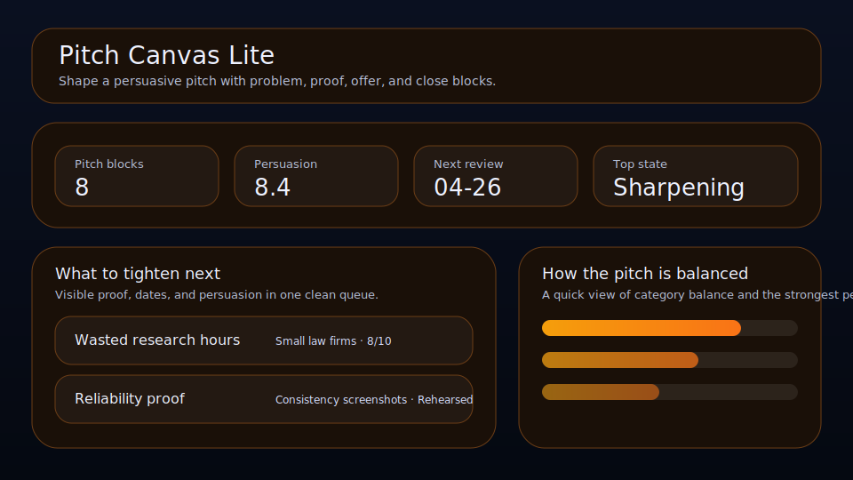

# Pitch Canvas Lite

Shape a persuasive pitch with problem, proof, offer, and close blocks.



Pitch Canvas Lite is a local-first workspace for founders, operators, and solo builders who want a cleaner way to manage pitch blocks. It keeps persuasion, audience, proof, and review timing visible so the right things move forward with less drift.

## What it does

- ranks pitch blocks by leverage, persuasion, timing, and friction
- tracks **audience**, **proof**, **next rehearsal**, and **persuasion** for each pitch block
- highlights the best current bet, the next review slot, and the strongest signal on the board
- renders a dedicated queue plus a category mix snapshot beneath the main board
- saves locally in the browser with JSON import/export backups
- quick action: **Schedule rehearsal**
- quick action: **Strengthen proof**
- quick action: **Copy pitch angle**

## Why it feels different

Pitch Canvas Lite is not just a generic list. It is shaped around the real workflow behind pitch blocks, so the board helps you decide what matters next instead of simply storing records.

## Quick start

```bash
git clone https://github.com/get2salam/pitch-canvas-lite.git
cd pitch-canvas-lite
python -m http.server 8000
```

Then open <http://localhost:8000>.

## Keyboard shortcuts

- `N` creates a new pitch block
- `/` focuses the search box

## Privacy

Everything stays in your browser unless you export a JSON backup.

## License

MIT
