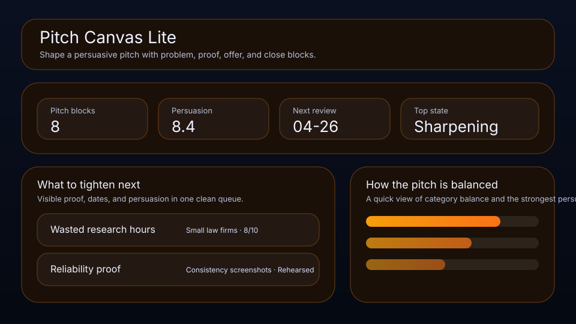

# Pitch Canvas Lite

Shape a persuasive pitch with problem, proof, offer, and close blocks.



Pitch Canvas Lite is a local-first workspace for founders, operators, and solo builders who want a cleaner way to manage pitch blocks. It keeps persuasion, audience, proof, and review timing visible so the right things move forward with less drift.

## What it does

- ranks pitch blocks by leverage, persuasion, timing, and friction
- tracks **audience**, **proof**, **next rehearsal**, and **persuasion** for each pitch block
- highlights the best current bet, the next review slot, and the strongest signal on the board
- renders a dedicated queue plus a category mix snapshot beneath the main board
- saves locally in the browser with JSON import/export backups
- quick action: **Schedule rehearsal**
- quick action: **Strengthen proof**
- quick action: **Copy pitch angle**

## Why it feels different

Pitch Canvas Lite is not just a generic list. It is shaped around the real workflow behind pitch blocks, so the board helps you decide what matters next instead of simply storing records.

## Quick start

```bash
git clone https://github.com/get2salam/pitch-canvas-lite.git
cd pitch-canvas-lite
python -m http.server 8000
```

Then open <http://localhost:8000>.

## Local verification

```bash
npm run verify
```

`npm run verify` first runs `npm run lint`, a `node --check` pass over every shipped script, then the dependency-free guard that validates the pitch-canvas SPEC, sample data, import limits, and DOM hooks. The guard only regex-extracts and evaluates small fragments of `js/main.js` (the SPEC object, a couple of named functions), so the lint pass exists to catch a plain syntax error anywhere else in the file before it ships. GitHub Actions runs the same `npm run verify` command on pushes and pull requests.

## Runnable import example

Generate a deterministic investor-review canvas that can be imported through the app's **Import** button:

```bash
npm run --silent example:backup > investor-review.json
python -m http.server 8000
```

Then open <http://localhost:8000>, choose **Import**, and select `investor-review.json`. The example produces a valid `pitch-canvas-lite/v3` backup with three pitch blocks covering problem framing, proof, and close rehearsal, so it doubles as a quick smoke test for the JSON import path.

## Runnable rehearsal brief example

Turn the same backup into a markdown rehearsal queue for a founder or investor update:

```bash
npm run --silent example:backup | npm run --silent example:brief
```

`example:brief` also works without piped input, in which case it reads the bundled investor-review backup generator. The script validates the backup schema, rejects unknown block categories or states, and prints the top active pitch blocks with audience, proof, rehearsal date, and priority so the exported JSON is useful outside the browser too.

## Keyboard shortcuts

- `N` creates a new pitch block and focuses its title for renaming
- `/` focuses the search box
- `Esc` clears the search box while it is focused

Shortcuts ignore key presses that include the `Cmd`, `Ctrl`, or `Alt` modifier so they do not collide with browser commands like new-window.

## Privacy

Everything stays in your browser unless you export a JSON backup. Exported files are named `pitch-canvas-lite-YYYY-MM-DD.json` so successive backups do not overwrite each other.

If the browser blocks local storage (private browsing, quota exceeded, or storage disabled), the app surfaces a single toast asking you to export a backup instead of silently dropping edits.

## Safety

Destructive actions confirm before they run so an accidental click cannot wipe your board. **Remove** asks before deleting the selected pitch block, and **Re-seed sample** asks before replacing the board when it already contains pitch blocks.

Imported backups are capped at 5 MB and 1000 pitch blocks so a corrupted or oversized file surfaces a clear error instead of locking the browser.

## License

MIT
